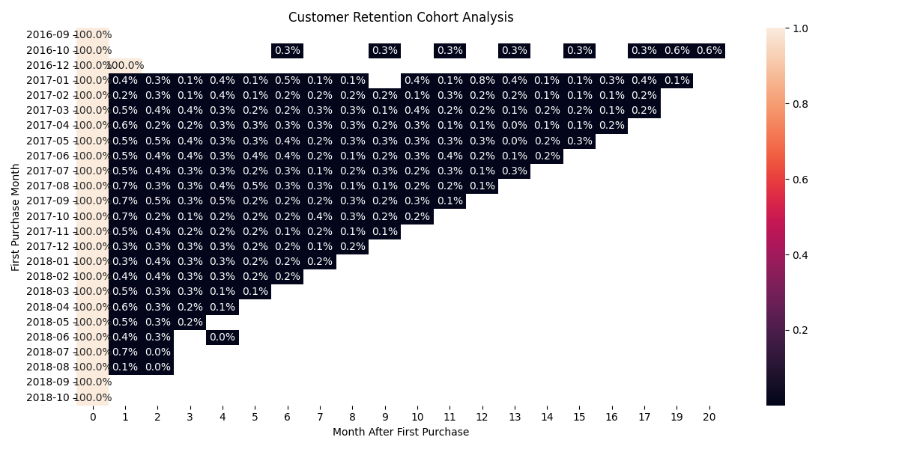
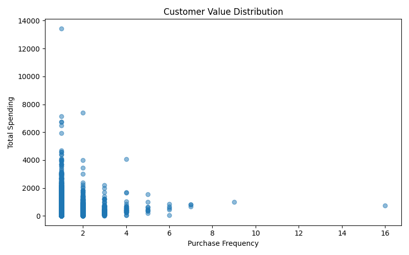
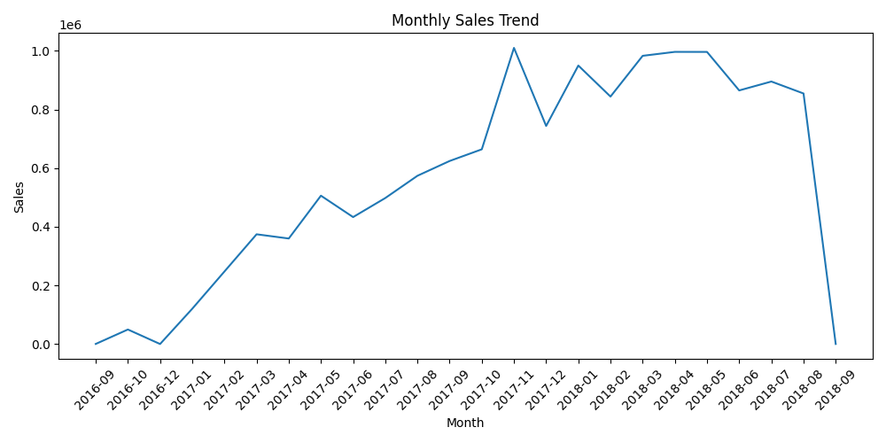

# E-commerce Customer Retention & RFM Analysis

## 1. Project Overview

This project analyzes customer purchase behavior based on a real-world Brazilian e-commerce transaction dataset.

The goal is to understand:

- Customer repeat purchase behavior
- Customer retention patterns
- Customer value segmentation

The project builds a complete data analysis pipeline:

**Raw Data → MySQL Database → SQL Analysis → Python Visualization → Business Insights**

---

## 2. Tech Stack

- **Database:** MySQL
- **Programming Language:** Python
- **Data Processing:** Pandas
- **Visualization:** Matplotlib, Seaborn
- **SQL Techniques:**
  - JOIN
  - GROUP BY
  - CASE WHEN
  - Common Table Expression (CTE)
  - Cohort Analysis

---

## 3. Dataset

Dataset:

Brazilian E-Commerce Public Dataset

Main tables:

- `customers`
- `orders`
- `order_items`

Data scale:

- 99k+ orders
- 99k+ customers
- 100k+ order item records

---

## 4. Database Construction

Imported raw CSV files into MySQL and built relational tables.

Data relationship:
customers
|
customer_id
|
orders
|
order_id
|
order_items

---

# 5. Analysis

## 5.1 Repeat Purchase Analysis

Analyzed customer purchase frequency and calculated repeat purchase behavior.

Methods:

- Customer-level aggregation
- JOIN customer and order tables
- COUNT order frequency

SQL file:
sql/01_repeat_purchase.sql

---

## 5.2 Customer Value Analysis

Analyzed customer spending behavior based on:

- Number of orders
- Total spending amount

SQL file:
sql/02_customer_value_analysis.sql

---

## 5.3 Cohort Retention Analysis

Grouped customers by their first purchase month and analyzed subsequent purchasing behavior.

Metrics:

- First purchase cohort
- Monthly active customers
- Customer retention trend

SQL files:
sql/03_retention_analysis.sql

sql/04_cohort_retention_matrix.sql

Visualization:

---

## 5.4 RFM Customer Segmentation

Built an RFM analysis model based on:

| Metric | Description |
|---|---|
| Recency | Time since last purchase |
| Frequency | Number of purchases |
| Monetary | Total spending amount |

SQL file:
sql/05_rfm_analysis.sql

Visualization:

---

# 6. Visualization Results

## Monthly Sales Trend

## Customer Retention Heatmap

## Customer Value Distribution

---

# 7. Key Findings

Based on the analysis:

- Most customers made only a single purchase, indicating challenges in customer retention.
- A small group of customers contributed a large proportion of total spending.
- Customer activity decreased as the time after first purchase increased.
- RFM analysis helped identify different customer value groups.

---

# 8. Project Structure
ecommerce/

├── data/
│ └── raw/

├── scripts/
│ ├── import_data.py
│ ├── import_orders.py
│ └── import_order_items.py

├── sql/
│ ├── 01_repeat_purchase.sql
│ ├── 02_customer_value_analysis.sql
│ ├── 03_retention_analysis.sql
│ ├── 04_cohort_retention_matrix.sql
│ └── 05_rfm_analysis.sql

├── result/
│ ├── data_result/
│ └── images/

├── analysis_visualization.py

└── README.md

---

# 9. Future Improvements

- Add customer churn prediction model
- Build interactive dashboard using Tableau / Power BI
- Perform customer lifetime value (CLV) analysis
